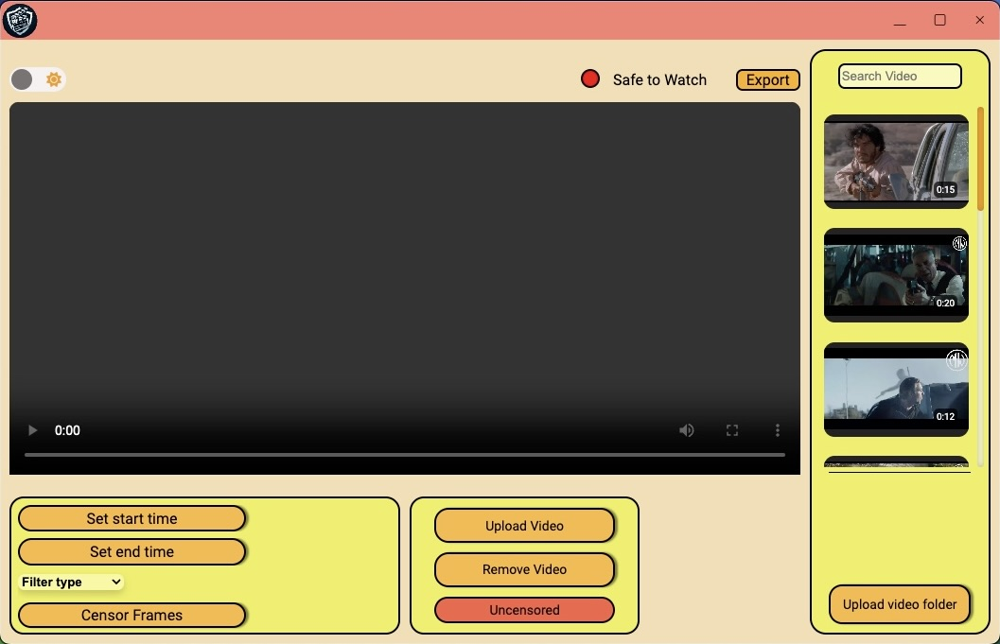
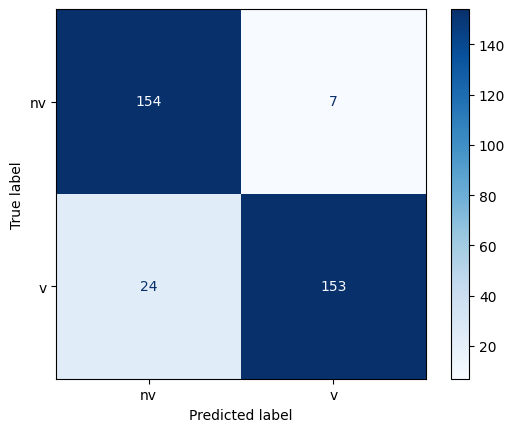
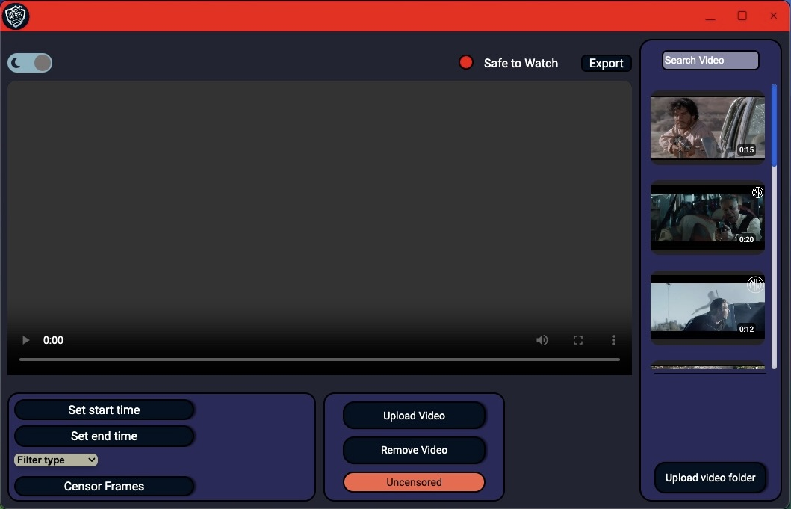

# VideoGuard

Welcome to the Video Player Application! This application allows you to upload and play videos with the option to apply filters for profanity, violence, and explicit content. Follow the steps below to get started.

## Table of Contents
1. [Implementation](#implementation)
   - [Dataset Collection](#dataset-collection)
   - [Feature Extraction](#feature-extraction)
   - [Pre-trained Models](#pre-trained-models)
   - [Model Architecture](#model-architecture)
   - [Training](#training)
   - [Testing](#testing)
     
2. [Using the Tool](#using-the-tool)
   - [Selecting a Video File](#selecting-a-video-file)
   - [Processing](#processing)
   - [Applying Filters](#applying-filters)
   - [Playing the Video](#playing-the-video)
   - [Uploading a Folder](#uploading-a-folder)
   - [Removing a Video](#removing-a-video)
   - [Changing the Theme](#changing-the-theme)

# Implementation

## 7.1 Dataset Collection

We collected around 3000 video clips [Dataset](https://github.com) containing various actions, including gunshots, stabbing, and strangling. Then, we extracted the features from the videos using ResNet50, a large CNN model trained on the ImageNet dataset.

## 7.2 Feature Extraction

After data collection, we used ResNet50 to extract features from each frame of the video clips.

## 7.3 Pre-trained Models

Besides data collection and training our own RNN, we utilized pretrained models to enhance the overall accuracy of our tool. The first pretrained model we used is trained on the NSFW dataset, classifying a frame or image into neutral, porn, or sexual classes. This model is employed in one of our three programs (nudity, violence, and profanity). Based on the classification of individual frames, we calculate the timestamp of that frame by dividing the frame number by fps. Additionally, we utilized Silero for converting speech to text, and then applied NLP to detect foul words in the text. NLP is employed to detect foul words based on the context of the line. We feed a 5-second audio segment to Silero and then check for foul words in the resulting text. If no words are found, we simply advance to the next 5 seconds. If a word is found, we advance 1 second forward and then again search for foul words in a 5-second window. If no words are found, then the foul word was within the 1 second that we advanced, so we mark that 1 second. We also used models to detect weapons in a frame, aiding in the accurate detection of violent scenes.

## 7.4 Model Architecture

For now, we have designed a RNN model—a neural network tailored for processing sequential data, particularly well-suited for tasks involving video or image sequences. The input is configured to handle batches of data, where each batch contains 100 frames. Each frame comprises 4x4 grids with 2048 channels, resulting in a NumPy array shape of (100, 4, 4, 2048), as mentioned earlier. The model employs a TimeDistributed layer to independently flatten the spatial dimensions of each frame. Following this, three LSTM layers with 64 units capture temporal patterns in the sequence. The activation function used in this layer is the hyperbolic tangent (tanh). The final layer is a Dense layer with a single neuron and a sigmoid activation function, tailored for producing binary classification outputs. The model is trained using the Adam optimizer and optimized for binary crossentropy loss, with accuracy serving as the performance metric.

## 7.5 Training

We trained the model on 80% of our 3000-video dataset, as mentioned earlier. To expedite the training process, we utilized the GPUs available on Google Colab. Currently, the model has been trained for 50 epochs; however, this may be subject to change as we plan to incorporate thousands of videos into our dataset. We trained CNN model with same 80% and 20% split.

## 7.6 Testing

We tested our trained RNN model on the remaining 20% of the data that was set aside during the training process. The obtained accuracy is 90%, but it’s important to note that this value may change as we continue to train the model with additional videos on a daily basis.

# Using the Tool

## 1. Selecting a Video File

To upload a video file:

1. Click the **Upload video** button. This will open the file manager.
2. Select the video you want to play.
3. Click **Open**.

## 2. Processing

After selecting a video, the application will process the file:

1. Wait until the **safe to watch** indicator turns green from red.
2. This indicates that the video is ready to be played and filtered.

## 3. Applying Filters

Once processing is complete:

1. A filter column will appear with three types of filters:
   - **Profanity**
   - **Violence**
   - **Explicit**
2. Toggle the preferred filter(s) by clicking on them.

## 4. Playing the Video

After selecting the desired filters:

1. Click the **Play** button to start playing the video.

## 5. Uploading a Folder

To upload a directory of videos:

1. Click the **Upload folder** button.
2. A file manager will open.
3. Select the folder containing your videos.
4. Click **Open**.
5. All video files in the selected folder will be displayed in the side panel.

## 6. Removing a Video

To remove a loaded video from the player:

1. Click the **Remove video** button.

## 7. Changing the Theme

To switch between light and dark themes:

1. Toggle the **theme** button located in the top left corner of the application.

   

Thank you for using the Video Player Application! If you encounter any issues or have any questions, please refer to the help section or contact support.

